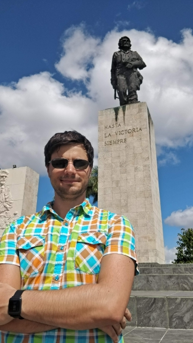

Hi, my name is Uroš, living and developing from Prague, Czech Republic. Although I came in contact with a lot of technologies, working in tech industry since 2006, I feel most comfortable in .NET world. I see Azure and Docker as a natural progression of that path, hence I fully embraced them in the last couple of years.

Besides being a full-time developer and system architect, I am software quality evangelist, teacher as well as student. Constantly improving myself and expanding knowledge of volatile tech world is what drives me day to day. I tend to spread that attitude to people I work with as well.

I tend to nitpick pull requests to death. Consider yourself warned :smile:

